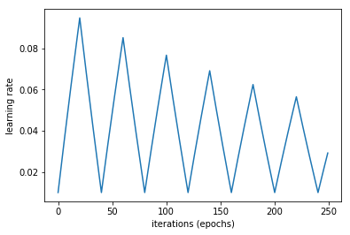

# Cyclic Learning Rate (CLR)
TensorFlow implementation of cyclic learning rate from the paper: [Smith, Leslie N. "Cyclical learning rates for training neural networks." 2017.](https://arxiv.org/pdf/1506.01186.pdf)

## TOC
1. [What is CLR ?](https://github.com/mhmoodlan/cyclic-learning-rate#what-is-clr-)
2. [Usage](https://github.com/mhmoodlan/cyclic-learning-rate#usage)
3. [Functional Tests](https://github.com/mhmoodlan/cyclic-learning-rate#running-functional-tests)
4. [License](https://github.com/mhmoodlan/cyclic-learning-rate#license)

## What is CLR ?
CLR is used to enhance the way the learning rate is scheduled during training, to provide better convergence and help in regularizing deep learning models.
It eliminates the need to experimentally find the best values for the global learning rate. Allowing the learning rate to cyclically vary between lower and upper boundary values.
The idea is to divide the training process into cycles determined by a _stepsize_ parameter, which defines the number of iterations in half a cycle. The author claims that it is often good to set the _stepsize_ to:
```
stepsize = (2 to 10) times the number of iterations in an epoch
```

The learning rate is computed as:
```python
cycle = floor( 1 + global_step / ( 2 * step_size ) )
x = abs( global_step / step_size – 2 * cycle + 1 )
clr = learning_rate + ( max_lr – learning_rate ) * max( 0 , 1 - x )
```

The author proposes three variations of this policy:
* 'triangular':
Default, linearly increasing then linearly decreasing the learning rate at each cycle.
* 'triangular2':
The same as the triangular policy except that the learning rate difference is cut in half at the end of each cycle. This means the learning rate difference drops after each cycle.
* 'exp_range':
The learning rate varies between the minimum and maximum boundaries and each boundary value declines by an exponential factor of:
```
𝑓 = 𝑔𝑎𝑚𝑚𝑎^𝑔𝑙𝑜𝑏𝑎𝑙_𝑠𝑡𝑒𝑝
```

Where _global_step_ is a number indicating the current iteration and _gamma_ is a constant passed as an argument to the CLR callback.

## Usage

Upgrade to the latest version of TensorFlow:


```
!pip install --upgrade tensorflow
```


```python
import tensorflow as tf
tf.__version__
```
`[out]: '1.9.0'`


### Eager mode
[Eager mode](https://www.tensorflow.org/guide/eager) evaluates operations immediately, without building graphs.

Enable eager execution:


```python
import tensorflow as tf
tf.enable_eager_execution()
```

Generate cyclic learning rates:


```python
import clr
import matplotlib.pyplot as plt
%matplotlib inline

print(tf.executing_eagerly()) # => True

rates = []

for i in range(0, 250):
    x = clr.cyclic_learning_rate(i, mode='exp_range', gamma=.997)
    rates.append(x())

plt.xlabel('iterations (epochs)')
plt.ylabel('learning rate')
plt.plot(range(250), rates)

#plt.savefig('exp_range.png', dpi=600)
```
```
[out]:
True
```


### Graph mode


```python
import tensorflow as tf
import clr
import matplotlib.pyplot as plt
%matplotlib inline

print(tf.executing_eagerly()) # => False

rates = []

with tf.Session() as sess:
    for i in range(0, 250):
        rates.append(sess.run(clr.cyclic_learning_rate(i, mode='exp_range', gamma=.997)))

plt.xlabel('iterations (epochs)')
plt.ylabel('learning rate')
plt.plot(range(250), rates)

#plt.savefig('exp_range.png', dpi=600)
```
```
[out]:
False
```


### Training Example:

* 'triangular2' mode cyclic learning rate:
```python
...
global_step = tf.Variable(0, trainable=False)
optimizer = tf.train.AdamOptimizer(learning_rate=
  clr.cyclic_learning_rate(global_step=global_step, mode='triangular2'))
train_op = optimizer.minimize(loss_op, global_step=global_step)
...
 with tf.Session() as sess:
    sess.run(init)
    for step in range(1, num_steps+1):
      assign_op = global_step.assign(step)
      sess.run(assign_op)
...
```

## Running Functional Tests


```python
from clr_test import CyclicLearningRateTest

CyclicLearningRateTest().test_triangular()
CyclicLearningRateTest().test_triangular2()
CyclicLearningRateTest().test_exp_range()
```

## License

This project is licensed under the MIT License - see the [LICENSE.md](LICENSE.md) file for details

Inspired by [Brad Kenstler keras CLR implementation.](https://github.com/bckenstler/CLR)
